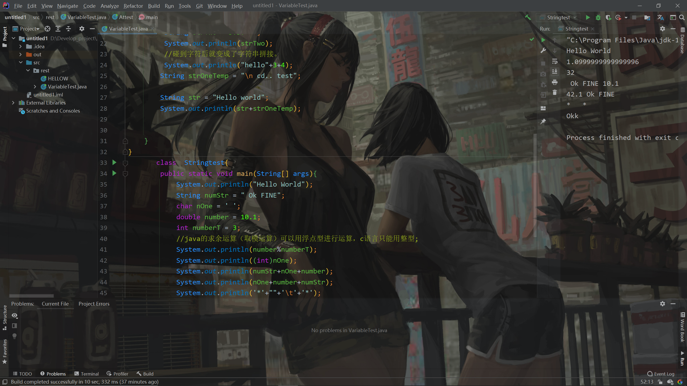

# 第二周总结

> 首先，要说一下，第一周没有学习，只是看了一下各种方向的划分。按计划来的，第一周看了所有值得见面的朋友；所以并没有必要去写第一周的总结报告。
>
> 寒假的学习总的来说从第二周开始

## 寒假计划

> 在总结之前，先梳理一下寒假的学习疾患

### 总的几方面

* **STM32，->硬件方面**
* **java后端，->软件方面**
* **计算机基础，->日常应用**
* ~~预习课程~~，->如果有时间


## 23~31日

> 算了一下，第二周倒是做了不少事情

大部分还是对寒假要学习的项目的准备，必不可少的如：**开发环境**。

由于我电脑路径的原因，下载的IDEA一直打不开（包括Jetbrain Toolbox），前两天一直在解决路径的问题，虽然最后还是没有解决，倒是在~~无尽~~的百度中学到了不少知识（因为知识储备少的可怕）->**环境变量的配置，以及为什么要配置环境变量；JDK，GCC，MinGW的作用；~~各种开发环境的安装~~**，以及零零散散的关于计算机基础的知识。

**最后还是不能正常使用：所有网上的解答都没有用**，痛定思痛，直接<u>重装系统</u>，顺便学习怎么重装系统，并且把windows改成专业版，解决中文路径问题。

重装系统，准备以及重新下载软件花费了一天。

随即开始具体的学习。下载了最新的JDK和MinGW，配好了java和c语言的环境，下载了IDEA，配合bilibili上面的视频配置了一下IDEA的快捷键以及常用设置。



**通过IDEA了解了大部分IDE的通用机制**

**下载并配置KEIL5，了解DAP仿真的机制，调试KEIL，成功在开发板上面下载并实现工程（资料自带）。~~我傻傻的以为学长们会布置任务，所以进度有点慢~~**

#### 开始了java的学习

从java基础开始，目前还在基本语法阶段，准备开始面向对象方面的学习。**~~未来吃饭的家伙~~**

```java
class Attest{
        public static void main(String[] args){
            System.out.println("Hello World");
        }
       }
```

> 总而言之，第二周更多的还是做准备工作，以及像二狗哥说的多尝试和看一些东西，找一下以后的学习方向